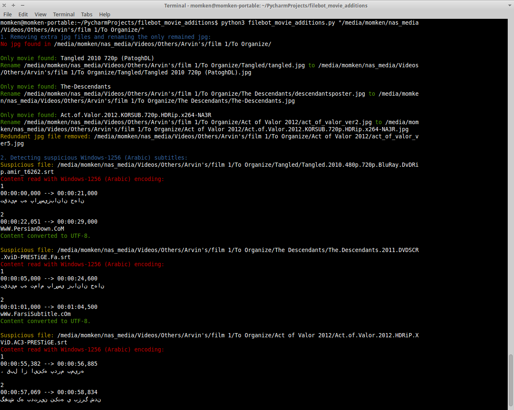

# Filebot Movie Additions Repairer
A script correcting Windows-1256 (Arabic) subtitles and renaming/removing jpg files; To be used before import in "filebot"

## When to use?
This python script is written to organize and repair some additional files usually placed beside movies. These cleanup tasks are required before importing movie folders (with Arabic/Persian subtitles) in ["FileBot"](http://www.filebot.net/), because Filebot can't correct these issues yet.

## What does it do?
Currently it repairs 2 set of movie additions:

1. It renames jpg poster of movie to the exact filename of movie; If more than 1 jpg file is present, it retains last one and deletes others. By using this correction, FileBot can relate jpg file to movie name and rename/move it according to movie file.

   Ex. In the picture below, you can see 2 jpg files whose name doesn't match filename of movie, and hence FileBot can't raname them alongside the movie.

   But after using this script redundant jpg files are removed and the only one is recognized in FileBot.

2. It detects Persian/Arabic subtitles in "Windows-1256" encoding and re-encodes them to "UTF-8"; Therefor they can generally be displayed in most video players ever.

   Ex. In the picture below, you can see a persian srt subtitle in "Windows-1256" encoding, which can't be displayed correctly by the text-editor (and video player).

   But after applying this script, the Arabic encoding of the file got detected by some heuristics and corrected to "UTF-8" encoding, which then could be displayed rightly by the text-editor and video player.


## How to use?
### Prerequisites
This script is written in Python3 and has used some of its libraries. So if you want to use it be sure to have python3 libraries below installed:
* chardet: A lib that tries to detect encoding of a file
* termcolor: Used to show colored texts in terminal outputs

If you use Ubuntu or any comparable GNU/Linux distro with pip installed, you can install them simply by running command:
```bash
sudo pip3 install chardet termcolor
```

After having all prerequisites installed on your system, use the script by syntax below:
```bash
python3 /<PATH_TO_filebot_movie_additions_DIRECTORY>/filebot_movie_additions.py <PATH_TO_FOLDER_OF_MOVIES>
```
...Ex.
```bash
momken@momken-portable:~/PycharmProjects/filebot_movie_additions$ python3 filebot_movie_additions.py "/media/momken/nas_media/Videos/Others/Arvin's/film 1/To Organize/"
```
...Output:


